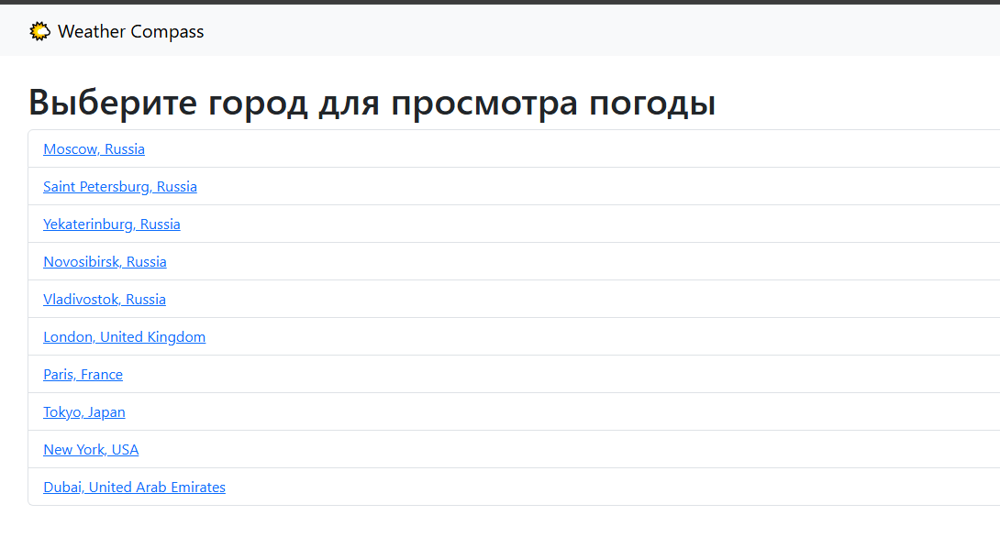
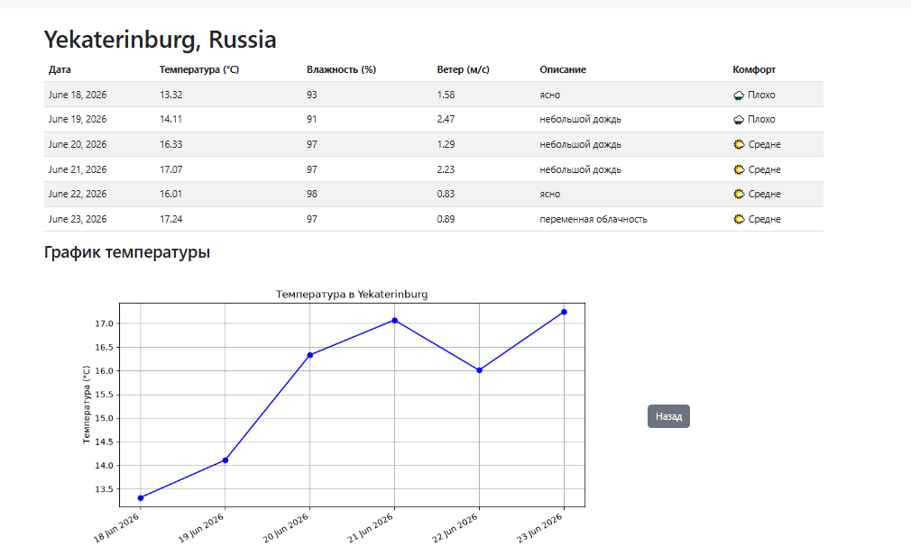
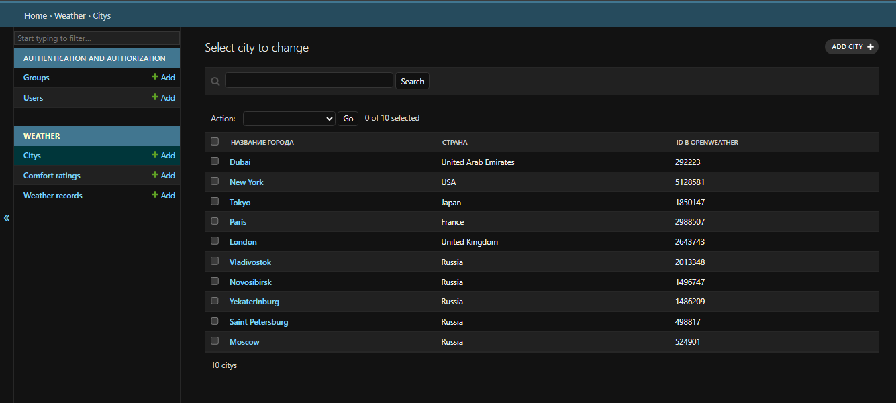

# WeatherComfort

**Интеллектуальный сервис оценки комфортности погоды для планирования пеших прогулок.**

WeatherComfort помогает жителям городов принимать решения о прогулках на основе актуальных погодных данных. Сервис получает прогноз через OpenWeatherMap API, рассчитывает уникальный индекс комфорта (на основе температуры, влажности и ветра) и визуализирует динамику погоды с помощью графиков.

**Демо-версия:** https://santana.pythonanywhere.com

---

## 🛠 Технологии

| Компонент | Технология |
|-----------|------------|
| **Backend** | Python 3.11, Django 5.2 |
| **Database** | SQLite (разработка) |
| **External API** | OpenWeatherMap |
| **Analytics** | Matplotlib |
| **Frontend** | Bootstrap 5 (адаптивный дизайн) |
| **Deployment** | PythonAnywhere |

---

## 📸 Скриншоты

### Главная страница — список городов

*На главной странице отображается список всех доступных городов*

### Страница города — прогноз с оценкой комфорта

*Таблица с прогнозом на 5 дней, колонка «Комфорт» с иконками и текстовой оценкой*

### Админка Django

*Панель администратора с моделями City, WeatherRecord, ComfortRating*

---

## 🚀 Как запустить проект локально

### 1. Клонируйте репозиторий
```bash
git clone https://github.com/santana677/weather-compass.git
cd weather-compass